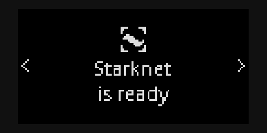
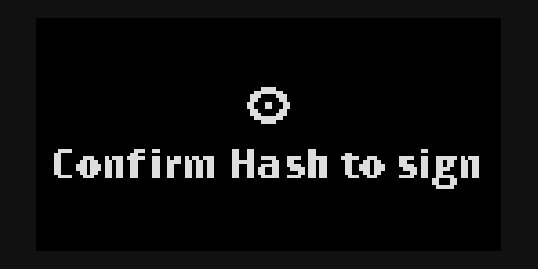
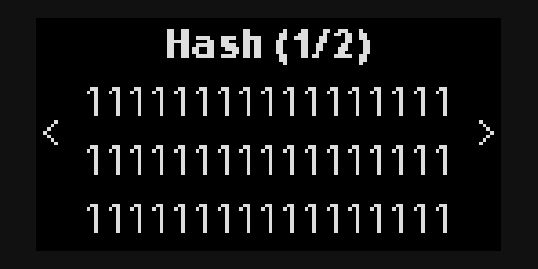

# Ledger hardware wallet

Starkli has first-class support for Ledger wallets (even works on Android via Termux). They can be used anywhere a signer is expected. Ledger-specific commands are also available to fully utilize the hardware wallet.

> ℹ️ **Note**
>
> As of this writing, the latest version of the Starknet Ledger app (`v1.1.1`) only supports blind signing a single hash. While not ideal, it's the most secure signer available.

## Installing the Ledger app

The first step of using Ledger is to install the [Starknet Ledger app](https://github.com/LedgerHQ/app-starknet), as the Ethereum app _cannot_ be used with Starknet.

You can verify that you've successfully installed the app by launching it:

<p align="center">
  
</p>

> 💡 **Tips**
>
> Make sure your Starknet app is launched when interacting with it from Starkli, or a connection error would occur.

### Installing via Ledger Live

Since the Starknet Ledger app is still experimental (until it stops relying on blind signing), you must explicitly allow experimental apps in Ledger Live to install it.

In Ledger Live (mobile or desktop), go to _Settings_ - _Developer_ and turn on _Allow experimental apps_.

Connect your Ledger device to Ledger Live. From the Ledger Live interface, search for the _Starknet_ app. Then simply click the _install_ button to install the app.

> ℹ️ **Note**
>
> Issues have been reported where the Starknet app wouldn't show up in the app catalog even with _Allow experimental apps_ turned on. In this case, you might want to try [installing via command line](#installing-via-command-line), but note that the app installed this way isn't signed by Ledger.
>
> It's also been reported that an available app update would be shown when connecting the device to Ledger Live again after a command line installation, allowing the unsigned app to be upgraded to the signed version.

### Installing via command line

> ⚠️ **Warning**
>
> The Starknet app installed this way is not signed by Ledger. Only do this when installing via Ledger Live does not work.

To install via command line, you must first obtain the compiled Starknet app artifact. Unfortunately, at this time, Ledger has only provided built artifacts for _Ledger Nano S+_ devices on GitHub. You may download these files of the latest (as of this writing) release from [here](https://github.com/LedgerHQ/app-starknet/releases/tag/nanosp_blind_signing_v1.0.0-dev-240404):

- `app.hex`
- `app_nanoplus.json`
- `starknet_small.gif`

For other Ledger devices, you can manually compile the project to obtain the compiled artifact, which is out of scope of the Starkli book.

Besides the app files, you'll also need to have [`ledgerctl`](https://github.com/LedgerHQ/ledgerctl) installed and the `ledgerctl` command executable.

Then, connect your Ledger device and leave the dashboard page open. Do not launch any app.

Now run this command _from the folder containing the 3 files above_:

```console
ledgerctl install -f app_nanoplus.json
```

You'll be prompted on your Ledger device to "allow unsafe manager", and enter your PIN again when confirming the installation.

Once installed, you can use the Starknet normally, with the caveat that a "this app is not genuine" message will be shown each time you launch the app, as the app is not signed by Ledger.

## Checking app version

Getting the Ledger app version from Starkli is a simple and effective way to verify that Starkli can work correctly with your Ledger device. With the Starknet Ledger app launched, simply run:

```console
starkli ledger app-version
```

Starkli should print the app version (e.g. `1.1.1`) to the console.

## Deciding on wallet paths

Before you actually start using the Ledger app, you must decide on what's known as "wallet paths" to be used with your accounts.

Specifically, the Starknet Ledger app uses [EIP-2645 HD paths](https://github.com/ethereum/ercs/blob/master/ERCS/erc-2645.md). Learn more about EIP-2645 wallet paths [on this page](./eip-2645-hd-paths).

## Getting public key

Once you've [decided on the path](#deciding-on-wallet-paths) to be used, you can use Starkli to read its corresponding public key. For example:

```console
starkli ledger get-public-key "m//starknet'/starkli'/0'/0'/0"
```

By default, the public key is shown on the Ledger device for manual confirmation:

<p align="center">
  
  
</p>

You can also disable the on-device confirmation by using the `--no-display` option:

```console
starkli ledger get-public-key "m//starknet'/starkli'/0'/0'/0" --no-display
```

## Using as signer

The most common use case of using Ledger with Starkli is for controlling Starknet accounts. You can use Ledger as a signer for anything that requires a signer:

- initializing and deploying accounts;
- declaring classes;
- deploying and invoking contracts.

To use Ledger as signer, simply use the `--ledger-path <HD_PATH>` option, similar to how the `--keystore` option is used for [encrypted keystores](./signers.md#encrypted-keystores). For example:

```console
starkli invoke --ledger-path "m//starknet'/starkli'/0'/0'/0" eth transfer 0x1234 u256:100 -w
```

A confirmation screen similar to this one below will be displayed on the Ledger device asking for approval:

<p align="center">
  
  
</p>

Once approved, the transaction will be sent out and Starkli would wait for its confirmation, the same as how it works with other types of signers.

It's possible to simplify the command by using the `STARKNET_LEDGER_PATH` environment variable:

```console
export STARKNET_LEDGER_PATH="m//starknet'/starkli'/0'/0'/0"
```

Then the same command above can instead be written as:

```console
starkli invoke eth transfer 0x1234 u256:100 -w
```

## Signing raw hashes

> ⚠️ **Warning**
>
> Blind signing a raw hash could be dangerous. Make sure you ONLY sign hashes from trusted sources. If you're sending transactions, [use Ledger as a signer](#using-as-signer) instead of using this command.

Starkli also allows you to sign a single raw hash with your Ledger device:

```console
starkli ledger sign-hash --path "m//starknet'/starkli'/0'/0'/0" 0x0111111111111111111111111111111111111111111111111111111111111111
```

Once approved, the signature will be printed to the console.
